# Stellar Go CLI - MozartPay — Orchestrated Agreements (OAs)

> **v0.2.0** · Built in Go · Pure-Go Soroban RPC · OG Technologies EU

A command-line interface for the MozartPay Orchestrated Agreements platform — enabling
DID-attested, VC-linked payments and asset issuance on Stellar with OA scoring,
StellarCarbon offset integration, x402 micropayments, and ISO 20022 compliance reporting.

Includes a pure-Go Soroban RPC client for smart contract deployment and invocation,
a built-in MCP server for AI assistant integration, and WebAuthn/FIDO2 passkey support.

---

## Architecture

```
[01] Identity    →  DID Attestation (web/key/ethr/ebsi) + National ID VC
[02] Wallet      →  wwWallet (passkey) + Stellar (native) + EOA + Testnet Faucet
[03] Payments    →  x402 · Tempo FX · Direct Stellar
     Assets      →  SAC/SEP-41 Fungible + Non-Fungible
[04] Contracts   →  Soroban Smart Contracts (deploy, invoke, simulate)
[05] Integrations → OA Score · StellarCarbon · x402 · Tempo
[06] Reporting   →  VC-linked audit trail · ISO 20022 pacs.008 XML
[07] AI          →  MCP Server (stdio/SSE) · Chat · Terminal
```

### System Architecture Diagram

```mermaid
flowchart TB
    subgraph EXT["EXTERNAL ACTORS & WALLETS"]
        user["CLI Operator<br/><i>Developer / Institution</i>"]:::core
        wwwallet["wwWallet<br/><i>Passkey / EUDI-style</i>"]:::external
        eoa["External EOA<br/><i>EVM Wallet</i>"]:::external
        verifier["Cross-Border Verifier<br/><i>VC Verification</i>"]:::external
    end

    subgraph CLI["MOZARTPAY CLI (Go · Pure-Go Soroban RPC)"]
        router["Command Router<br/><i>did · wallet · pay · contract · asset · mcp · report</i>"]:::core
        identity["Identity Layer<br/><i>DID Attestation · National ID VC</i>"]:::core
        wallet["Wallet Layer<br/><i>wwWallet · Stellar Native · EOA · Faucet</i>"]:::core
        payments["Payments Layer<br/><i>x402 · Tempo FX · Direct Stellar</i>"]:::core
        assets["Assets Layer<br/><i>SAC / SEP-41 FT + NFA</i>"]:::core
        contracts["Contracts Layer<br/><i>Soroban Deploy · Invoke · Simulate</i>"]:::core
        integrations["Integrations Layer<br/><i>OA Score · StellarCarbon</i>"]:::external
        reporting["Reporting Layer<br/><i>VC Audit Trail · ISO 20022 pacs.008</i>"]:::core
        mcp["MCP Server<br/><i>stdio / SSE · AI Assistant Tools</i>"]:::core
    end

    subgraph BC["BLOCKCHAIN & PAYMENT RAILS"]
        stellar["Stellar Network<br/><i>Testnet / Pubnet · SAC · SEP-41</i>"]:::core
        soroban["Soroban RPC<br/><i>Smart Contract Execution</i>"]:::core
        ebsi["EBSI v3<br/><i>did:ebsi Registry · EU Blockchain</i>"]:::external
        x402["x402 Facilitator<br/><i>HTTP 402 Pay-Per-Use</i>"]:::external
        tempo["Tempo<br/><i>FX Quotes · Cross-Currency Rails</i>"]:::external
    end

    subgraph DATA["DATA & STATE LAYER"]
        config[("Config Store<br/><i>~/.mozartpay/config.json</i>")]:::core
        state[("State Files<br/><i>~/.mozartpay/state/ · DIDs · VCs · Assets · Reports</i>")]:::core
    end

    user --> router
    wwwallet --> wallet
    eoa --> wallet
    verifier --> identity

    router --> identity
    router --> wallet
    router --> payments
    router --> assets
    router --> contracts
    router --> integrations
    router --> reporting
    router --> mcp

    identity --> ebsi
    wallet --> stellar
    payments --> stellar
    payments --> x402
    payments --> tempo
    assets --> stellar
    contracts --> soroban
    integrations --> stellar

    identity --> state
    assets --> state
    payments --> state
    reporting --> state
    router --> config

    classDef external fill:#e8f1fb,stroke:#0066cc,stroke-width:2px,color:#111
    classDef core fill:#fff,stroke:#888,stroke-width:1px,color:#555
```



**Legend:** Blue-bordered components are **external services and integrations** — third-party
networks and protocols (EBSI v3, x402, Tempo, wwWallet, external EOA) that the CLI orchestrates.
Gray components are core CLI modules and local state owned by MozartPay itself.

---

## Features

- **DID Attestation** — Create and verify W3C DIDs (web, key, ethr, ebsi) with National ID Verifiable Credentials
- **Wallet Management** — Connect wwWallet, Stellar native, or external EOA; testnet faucet funding
- **Payments** — x402 pay-per-use, Tempo FX quotes, direct Stellar payments
- **Asset Creation** — SEP-41 fungible tokens and non-fungible assets with OA score and carbon credits
- **Soroban Contracts** — Deploy any `.wasm` file, invoke contract methods, simulate read-only queries — all in pure Go
- **MCP Server** — Expose CLI functionality as tools for AI assistants via stdio or SSE transport
- **WebAuthn/FIDO2** — Passkey-based authentication server
- **Compliance Reporting** — VC-linked audit trails, ISO 20022 pacs.008 XML export
- **Integrations** — OA Score, StellarCarbon, x402, Tempo FX
- **VC API Server** — W3C VC API-compliant HTTP endpoints for conformance testing
- **Tansu Integration** — Query project governance, proposals, and attestations on Stellar
- **Triangular Arbitrage** — Scan, monitor, and backtest 3-leg arbitrage cycles
- **AI Fine-Tuning** — Generate training data and fine-tune local GGUF models for chat
- **ZK Proofs** — Noir-based zero-knowledge proof generation and verification
- **Market Data** — Finnhub and Alpha Vantage integrations for quotes and news

## Requirements

- Go 1.24+
- Rust toolchain (for building smart contracts, optional)
- Docker & Docker Compose (optional, for containerized deployment)

## Build & Installation

```bash
# Build from source
make build              # → dist/mozartpay
make install            # → $(GOPATH)/bin/mozartpay

# Docker
docker compose up       # Start all services (MCP, WebAuthn, PostgreSQL, Redis)

# Kubernetes
# See mozartpay/k8s/README.md for deployment instructions
```

## Quick Start

```bash
# Initialize
mozartpay init

# 1. Create identity
mozartpay did attest --method ebsi --vc national-id --name "Your Name" --country AT

# 2. Connect wallet
mozartpay wallet connect --provider stellar --network stellar-testnet
mozartpay wallet fund --network stellar-testnet

# 3. Deploy a Soroban smart contract
mozartpay contract deploy --wasm contracts/dist/mozartpay_contracts.wasm --network stellar-testnet

# 4. Create an on-chain agreement
mozartpay contract create-agreement --dispute-window 86400

# 5. Create a SEP-41 token with score + carbon
mozartpay asset create-ft --name "MyToken" --symbol MTK \
  --supply 1000000 --with-score --with-carbon

# 6. Make a payment
mozartpay pay send --to <address> --amount 10 --asset USDC --rail x402

# 7. Generate compliance report
mozartpay report generate --vc-attach

# Export ISO 20022
mozartpay report iso20022
```

## Full Demo

```bash
make demo-full
```

## Commands

### Identity

| Command | Description |
|---------|-------------|
| `mozartpay did create` | Create a DID document |
| `mozartpay did attest` | Issue a National ID Verifiable Credential |
| `mozartpay did verify` | Verify a saved VC |

### Wallet

| Command | Description |
|---------|-------------|
| `mozartpay wallet connect` | Connect wwWallet, Stellar, or external EOA |
| `mozartpay wallet fund` | Fund testnet account via faucet |
| `mozartpay wallet balance` | Query account balance |

### Transactions

| Command | Description |
|---------|-------------|
| `mozartpay pay send` | Send payment (x402/tempo/direct) |
| `mozartpay pay quote` | Get Tempo FX rate |
| `mozartpay pay x402` | HTTP 402 pay-per-use flow |
| `mozartpay swap quote` | Get asset swap quote |
| `mozartpay swap execute` | Execute asset swap |
| `mozartpay pool` | Liquidity pool operations |
| `mozartpay trade` | Trading operations |
| `mozartpay asset create-ft` | Create SEP-41 fungible token |
| `mozartpay asset create-nfa` | Create SEP-41 non-fungible asset |
| `mozartpay asset score` | Attach OA score |
| `mozartpay asset carbon` | Attach StellarCarbon credits |
| `mozartpay claimable` | Claimable balance operations |
| `mozartpay swap triangular scan` | Scan 3-leg arbitrage cycles |
| `mozartpay swap triangular monitor` | Continuous arbitrage monitoring |
| `mozartpay swap triangular backtest` | Backtest arbitrage strategies |

### Exchanges

| Command | Description |
|---------|-------------|
| `mozartpay exchange` | Exchange management |

### Contracts (Soroban)

| Command | Description |
|---------|-------------|
| `mozartpay contract deploy` | Deploy any `.wasm` contract to Soroban |
| `mozartpay contract set` | Store a contract ID in config |
| `mozartpay contract create-agreement` | Create an on-chain orchestrated agreement |
| `mozartpay contract show` | Display agreement details (simulate-only) |
| `mozartpay contract list` | List agreements by initiator (simulate-only) |
| `mozartpay contract attest-identity` | Attest DID and VC for an agreement (Layer 1) |
| `mozartpay contract connect-wallet` | Connect wallet to an agreement (Layer 2) |
| `mozartpay contract fund-asset` | Fund and set asset for an agreement (Layer 3) |
| `mozartpay contract execute` | Execute an agreement (Layer 5) |
| `mozartpay contract settle` | Settle an agreement |

### Integrations

| Command | Description |
|---------|-------------|
| `mozartpay integrations list` | List all integrations |
| `mozartpay integrations ping` | Health-check integrations |
| `mozartpay integrations score` | Add an OA score to latest asset |
| `mozartpay integrations carbon` | StellarCarbon management |
| `mozartpay integrations tansu` | Query Tansu governance (projects, proposals, badges) |
| `mozartpay integrations news` | Market news feed |
| `mozartpay integrations finnhub` | Finnhub market data |

### Reporting

| Command | Description |
|---------|-------------|
| `mozartpay report generate` | Post-transaction compliance report |
| `mozartpay report iso20022` | Export ISO 20022 pacs.008 XML |

### AI

| Command | Description |
|---------|-------------|
| `mozartpay mcp` | Start MCP server for AI assistant integration (stdio/SSE) |
| `mozartpay chat` | AI chat interface |
| `mozartpay chat train-data` | Generate synthetic fine-tuning data |
| `mozartpay chat finetune` | Fine-tune local chat model |
| `mozartpay chat model` | Manage GGUF models |
| `mozartpay terminal` | Interactive terminal mode |

### System

| Command | Description |
|---------|-------------|
| `mozartpay init` | Initialize configuration |
| `mozartpay status` | Session and system status |
| `mozartpay flow` | Print component flow diagram |
| `mozartpay network` | Network management |
| `mozartpay vc-api` | W3C VC API server (issue/verify endpoints) |
| `mozartpay version` | Print version |

## Soroban Contract Deployment

MozartPay includes a pure-Go Soroban RPC client — no external `stellar` CLI required.

### Deploy a Contract

```bash
# Deploy with deployer as constructor owner (default)
mozartpay contract deploy --wasm contracts/dist/mozartpay_contracts.wasm --network stellar-testnet

# Deploy with specific owner
mozartpay contract deploy --wasm my_contract.wasm --network stellar-testnet --owner GBXXXX...

# Deploy with custom constructor args (base64 XDR ScVal)
mozartpay contract deploy --wasm my_contract.wasm --network stellar-mainnet \
  --constructor-args "AAAAEAAAAAEAAAAA,AAAAEAAAAAEAAAAA"
```

The deploy command:
1. Uploads WASM bytecode to Soroban network
2. Creates a contract instance from the uploaded WASM hash
3. Extracts contract ID from the simulation response
4. Saves the contract ID to config

### Simulate-Only Queries (Read-Only)

```bash
# List agreements by initiator (no transaction submitted)
mozartpay contract list

# Show agreement details
mozartpay contract show --id <agreement-id>
```

### Invoke Write Methods

```bash
# Create an agreement
mozartpay contract create-agreement --dispute-window 86400

# Attest identity
mozartpay contract attest-identity --did did:web:example.com --method web --vc-type national_id

# Connect wallet
mozartpay contract connect-wallet --type wwwallet --passkey

# Fund asset
mozartpay contract fund-asset --asset USDC --amount 100 --locked 0

# Execute agreement
mozartpay contract execute --tx-hash <settlement-hash>

# Settle agreement
mozartpay contract settle
```

### Networks

| Network | RPC URL | Passphrase |
|---------|---------|------------|
| Testnet | `https://soroban-testnet.stellar.org` | Stellar Testnet |
| Mainnet | `https://soroban-mainnet.stellar.org` | Stellar Public Network |

## MCP Server

MozartPay includes a built-in MCP (Model Context Protocol) server for AI assistant integration.

### Starting the MCP Server

```bash
# stdio transport (for direct AI integration, e.g., with Claude/Cursor)
mozartpay mcp

# SSE transport over HTTP
mozartpay mcp --transport sse --port 3000

# Verbose logging
mozartpay mcp --verbose
```

### Available MCP Tools

| Tool | Description |
|------|-------------|
| `wallet_list` | List all configured wallets |
| `wallet_balance` | Query wallet balance |
| `swap_quote` | Get asset swap quote |
| `swap_execute` | Execute asset swap |
| `pay_send` | Send payment |
| `pay_request` | Request payment |
| `asset_list` | List assets |
| `asset_trust` | Add trustline |
| `system_status` | System status |
| `system_health` | Health check |

### Docker Deployment

```bash
docker compose up mcp  # MCP server on port 3000 with SSE transport
```

## Smart Contracts

The Soroban smart contracts are written in Rust and located in `mozartpay/contracts/`.

- **Source**: `mozartpay/contracts/src/lib.rs`, `mozartpay/contracts/src/orchestrated_agreement.rs`
- **Architecture**: See `mozartpay/contracts/ARCHITECTURE.md` for the full security architecture
- **Build**: `cd mozartpay/contracts && make build` (produces `contracts/dist/*.wasm`)

The main contract implements the 5-layer Orchestrated Agreement flow:
1. **Identity** — DID attestation with Verifiable Credentials
2. **Wallet** — WebAuthn/passkey wallet connection
3. **Assets** — SAC/SEP-41 fungible/non-fungible asset funding
4. **Integrations** — OA Score, StellarCarbon, x402, Tempo
5. **Reporting** — On-chain audit trail, ISO 20022 compliance

## Docker & Kubernetes

### Docker

Multi-service Dockerfile supports three images:
- **CLI** — MozartPay CLI binary
- **MCP** — MCP server with SSE transport (port 3000)
- **WebAuthn** — WebAuthn/FIDO2 server (port 8000)

```bash
docker compose up              # All services
docker compose up mcp          # MCP server only
docker compose up webauthn     # WebAuthn server only
```

### Kubernetes

Kubernetes manifests in `mozartpay/k8s/` include:
- Namespace, PostgreSQL, Redis, WebAuthn, MCP, Horizon, Networking, Monitoring, Ollama

See `mozartpay/k8s/README.md` for detailed deployment instructions.

## Test Vectors

Conformance test vectors are in `test-vectors/` at the repo root. See `test-vectors/README.md` for details.

## Additional Documentation

- `CHANGELOG.md` — Release history (Keep a Changelog + SemVer)
- `mozartpay/AGENTS.md` — AI coding guidelines and MCP server integration docs
- `mozartpay/SECURITY.md` — Comprehensive security policy
- `mozartpay/docs/` — Additional docs (MCP, k8s, chat, passkey, wwallet)
- `mozartpay/contracts/ARCHITECTURE.md` — Smart contract security architecture

## Standards Compliance

- **W3C DID Core 1.0** — Decentralized Identifiers
- **W3C Verifiable Credentials** — VC Data Model 2.0
- **EBSI v3** — EU Blockchain Services Infrastructure
- **SEP-41** — Stellar Token Interface
- **ISO 20022** — Financial messaging (pacs.002, pacs.004, pacs.008, pacs.009)
- **eIDAS 2.0** — EU Digital Identity Framework
- **HTTP 402 / x402** — Pay-per-use web protocol

## Configuration

Config stored in `~/.mozartpay/config.json`.
State files stored in `~/.mozartpay/state/`.

Key config fields:
- `Network` — Stellar network (`stellar-testnet` or `stellar-mainnet`)
- `ContractID` — Last deployed Soroban contract ID
- `LastAgreementID` — Most recent agreement ID
- `AgreementIDs` — All agreement IDs created

## Contributing

- Follow existing code conventions (see `mozartpay/AGENTS.md`)
- Run `make lint` before submitting changes
- Run `make security` for security scanning
- Test on testnet before mainnet
- No shell-out to stellar CLI — use pure-Go Soroban client
- Add user-facing changes to `CHANGELOG.md` under `[Unreleased]`

---

*Built by OG Technologies EU · Vienna, Austria*  
*Web3 · Payments · Education · Standards*

Licence: Apache 2.0
