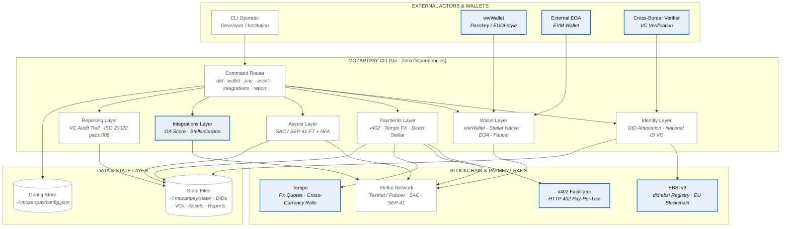

# MozartPay CLI — Orchestrated Agreements

> **v0.1.0-mvp** · Built in Go · Zero external dependencies · OG Technologies EU

A command-line interface for the MozartPay Orchestrated Agreements platform — enabling
DID-attested, VC-linked payments and asset issuance on Stellar with OA scoring,
StellarCarbon offset integration, x402 micropayments, and ISO 20022 compliance reporting.

---

## Architecture

```
[01] Identity    →  DID Attestation (web/key/ethr/ebsi) + National ID VC
[02] Wallet      →  wwWallet (passkey) + Stellar (native) + EOA + Testnet Faucet
[03] Payments    →  x402 · Tempo FX · Direct Stellar
     Assets      →  SAC/SEP-41 Fungible + Non-Fungible
[04] Integrations → OA Score · StellarCarbon · x402 · Tempo
[05] Reporting   →  VC-linked audit trail · ISO 20022 pacs.008 XML
```

## System Architecture

The MozartPay CLI is organized as a layered, zero-dependency Go application where each layer
maps to a distinct domain concern — from decentralized identity through payment rails to
compliance reporting.

### Architectural Principles

1. **Decentralized Identity** – No central identity provider; trust via cryptographic proofs using DIDs (`web`/`key`/`ethr`/`ebsi`) and W3C VC 2.0 national-ID attestation.
2. **Compliance-by-Design** – ISO 20022 pacs.008 reporting, eIDAS 2.0 alignment, and VC-linked audit trails are built into every transaction, not bolted on.
3. **Interoperability** – Open standards (W3C DID Core, VC Data Model 2.0, SEP-41, EBSI v3, HTTP 402/x402) for cross-platform and cross-border portability.
4. **Zero-Dependency Portability** – Pure Go standard library; a single static binary with no external runtime dependencies.

### Architecture Diagram



**Legend:** Blue-bordered components are **external services and integrations** — third-party
networks and protocols (EBSI v3, x402, Tempo, wwWallet, external EOA) that the CLI orchestrates.
Gray components are core CLI modules and local state owned by MozartPay itself.

### Components

#### Identity & Wallet

| Component | Description |
|---|---|
| DID Attestation | Create and attest DIDs across `web`, `key`, `ethr`, and `ebsi` methods |
| National ID VC | Issue and verify W3C VC 2.0 national identity credentials |
| wwWallet | Passkey-based wallet connection (EUDI-style flow) |
| Stellar Native Wallet | Native Stellar account management on testnet/pubnet |
| External EOA | Connect external EVM-style externally owned accounts |
| Testnet Faucet | Fund testnet accounts via Stellar Friendbot |

#### Payments & Assets

| Component | Description |
|---|---|
| x402 Micropayments | HTTP 402 pay-per-use payment flow |
| Tempo FX | Cross-currency rate quotes and FX routing |
| Direct Stellar | Native Stellar payment path |
| SAC / SEP-41 FT | Fungible token issuance via Stellar Asset Contract / SEP-41 |
| Non-Fungible Asset | SEP-41 non-fungible asset issuance |

#### Integrations

| Integration | Description |
|---|---|
| OA Score | Orchestrated Agreements scoring attached to issued assets |
| StellarCarbon | Carbon credit offset management on Stellar |
| x402 | Pay-per-use protocol integration |
| Tempo | FX and cross-currency settlement integration |

#### Reporting & Compliance

| Component | Description |
|---|---|
| Compliance Report | Post-transaction report with VC-linked audit trail |
| ISO 20022 Export | pacs.008.001.08 XML export for financial messaging compliance |

---

## Requirements

- Go 1.22+
- No external dependencies (pure stdlib)

## Build

```bash
make build          # → dist/mozartpay
make install        # → $(GOPATH)/bin/mozartpay
```

## Quick Start

```bash
# Initialize
mozartpay init

# 1. Create identity
mozartpay did attest --method ebsi --vc national-id --name "Your Name" --country AT

# 2. Connect wallet
mozartpay wallet connect --provider stellar --network stellar-testnet
mozartpay wallet fund --network stellar-testnet

# 3. Create a SEP-41 token with score + carbon
mozartpay asset create-ft --name "MyToken" --symbol MTK \
  --supply 1000000 --with-score --with-carbon

# 4. Make a payment
mozartpay pay send --to <address> --amount 10 --asset USDC --rail x402

# 5. Generate compliance report
mozartpay report generate --vc-attach

# Export ISO 20022
mozartpay report iso20022
```

## Full Demo

```bash
make demo-full
```

## Commands

| Command | Description |
|---------|-------------|
| `mozartpay did create` | Create a DID document |
| `mozartpay did attest` | Issue a National ID Verifiable Credential |
| `mozartpay did verify` | Verify a saved VC |
| `mozartpay wallet connect` | Connect wwWallet, Stellar, or external EOA |
| `mozartpay wallet fund` | Fund testnet account via faucet |
| `mozartpay wallet balance` | Query account balance |
| `mozartpay pay send` | Send payment (x402/tempo/direct) |
| `mozartpay pay quote` | Get Tempo FX rate |
| `mozartpay pay x402` | HTTP 402 pay-per-use flow |
| `mozartpay asset create-ft` | Create SEP-41 fungible token |
| `mozartpay asset create-nfa` | Create SEP-41 non-fungible asset |
| `mozartpay asset score` | Attach OA score |
| `mozartpay asset carbon` | Attach StellarCarbon credits |
| `mozartpay integrations list` | List all integrations |
| `mozartpay integrations ping` | Health-check integrations |
| `mozartpay integrations score` | Add an OA score to latest asset |
| `mozartpay integrations carbon` | StellarCarbon management |
| `mozartpay report generate` | Post-transaction compliance report |
| `mozartpay report iso20022` | Export ISO 20022 pacs.008 XML |
| `mozartpay flow` | Print component flow diagram |
| `mozartpay status` | Session and system status |
| `mozartpay init` | Initialize configuration |

## Standards Compliance

- **W3C DID Core 1.0** — Decentralized Identifiers
- **W3C Verifiable Credentials** — VC Data Model 2.0
- **EBSI v3** — EU Blockchain Services Infrastructure
- **SEP-41** — Stellar Token Interface
- **ISO 20022** — Financial messaging (pacs.008.001.08)
- **eIDAS 2.0** — EU Digital Identity Framework
- **HTTP 402 / x402** — Pay-per-use web protocol

## Configuration

Config stored in `~/.mozartpay/config.json`.
State files stored in `~/.mozartpay/state/`.

---

*Built by OG Technologies EU · Vienna, Austria*  
*Web3 · Payments · Education · Standards*


